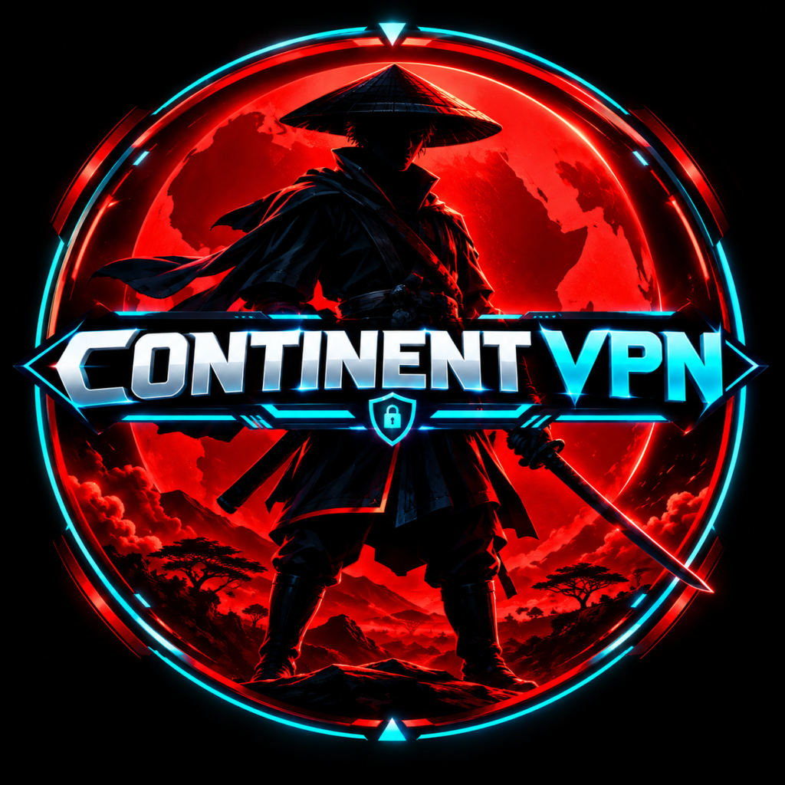

# 🛡️ CONTINENT VPN — Application Mobile Cyber-Souveraine

<div align="center">
  
  <h3>Votre liberté numérique, notre priorité.</h3>
  <p><strong>Architecture Mobile React Native (Expo SDK 54 / TypeScript / Cyber-Anime Aesthetic)</strong></p>
  <p>
    
    
    
    
    
  </p>
</div>

---

## 📖 Sommaire
1. [Vision & Philosophie CONTINENT VPN](#-vision--philosophie-continent-vpn)
2. [Identité Visuelle & Système Guardian](#-identité-visuelle--système-guardian)
3. [Fonctionnalités Clés](#-fonctionnalités-clés)
4. [Pile Technologique](#-pile-technologique)
5. [Structure du Projet](#-structure-du-projet)
6. [Installation & Démarrage Rapide](#-installation--démarrage-rapide)
7. [Variables d'Environnement](#-variables-denvironnement)
8. [Commandes de Build & Typage](#-commandes-de-build--typage)
9. [Workflow Git & Stratégie de Branches](#-workflow-git--stratégie-de-branches)
10. [Règles Strictes de Sécurité & Confidentialité](#-règles-strictes-de-sécurité--confidentialité)
11. [Feuille de Route (Roadmap)](#-feuille-de-route-roadmap)

---

## 👁️ Vision & Philosophie CONTINENT VPN

**CONTINENT VPN** est une application mobile de cybersécurité de nouvelle génération conçue pour offrir une souveraineté numérique absolue, une vitesse maximale et une ergonomie sans friction.

- **Souveraineté Numérique Totale** : Chiffrement quantique de bout en bout et politique inébranlable **Zéro-Journal (No-Logs)**.
- **Modèle de Maillage Intelligent (CONTINENT Mesh)** : Abandon des listes de pays primitives au profit d'un routage neuronal auto-adaptatif sélectionnant dynamiquement les relais à plus faible latence et gigue.
- **Refus du Profilage Big Tech** : Aucune passerelle OAuth tierce (Google, Apple, Facebook) susceptible de corréler votre trafic VPN avec un profil commercial. Authentification cryptographique indépendante et respectueuse de la vie privée.

---

## ⚔️ Identité Visuelle & Système Guardian

L'interface utilisateur déploie une esthétique **cyber-anime / néo-tokyo africaine** d'inspiration guerrier cybernétique avec :
- **Arrière-plan Cyber Sombre Profond** (`#05070A`, `#071525`, `#0A1322`)
- **Accents Néon Fluides** : Bleu Cyan Néon (`#00E5FF`), Bleu Électrique (`#168BFF`), Rouge Énergie/Alerte (`#FF1018`), Émeraude Bouclier (`#00FF88`), Violet Cyber (`#7C3AED`)
- **Moteur Visuel Guardian à 4 États Réactifs** :
  1. *Dormant / Veille* : Silhouette prête, anneaux radar au ralenti, lueur cyan diffuse.
  2. *Connexion / Négociation de Clés* : Particules énergétiques accélérées, anneaux concentriques en rotation.
  3. *Protégé / Souverain* : Aura cyan éclatante, bouclier impénétrable actif, télémétrie en temps réel.
  4. *Alerte Menace Cyber* : Impulsion rouge ardente, verrouillage préventif Kill Switch, notification d'interception.
- **Réacteur Concentrique Central (Connection Core)** : Remplacement des boutons on/off banals par un cœur énergétique sci-fi segmenté affichant le ping et le protocole actif.

---

## 🚀 Fonctionnalités Clés

### 1. Écran de Démarrage & Onboarding Cyber
- Splash screen animé avec initialisation progressive du bouclier.
- Parcours didactique en 3 étapes : Chiffrement Zéro-Journal, CONTINENT Core Mesh, et Défense Active Kill Switch.

### 2. Authentification Cryptographique Souveraine
- Inscription et connexion par alias et email sécurisé.
- Validation à double facteur (OTP à 6 chiffres) avec minuterie dynamique.
- Récupération de clé maîtresse sans dépendance externe.

### 3. Tableau de Bord — Command Center
- Héros Guardian dynamique et sélecteur d'états cybernétiques.
- Cœur de connexion interactif avec retour tactile.
- Carte d'accès rapide au nœud mesh avec latence et badge d'optimisation.
- Télémétrie en direct : Vitesse de téléchargement/envoi, IP masquée, durée de session.
- Indicateurs instantanés d'état de défense (Kill Switch, Anti-Menace, Protection DNS).

### 4. Tableau Analytique & Télémétrie d'Activité
- Jauge d'utilisation de bande passante avec barre de progression néon.
- Graphique SVG vectoriel temps réel de débit (Throughput) avec courbe de Bézier, remplissage dégradé et suivi de crête.
- Compteur de menaces neutralisées (Pisteurs, Phishing, Scripts malveillants, Fuites DNS).
- Historique détaillé des sessions protégées.

### 5. Nœuds de Réseau & Modes de Routage
- 4 modes stratégiques : *Auto-Mesh Intelligent*, *Ultra-Basse Latence*, *Double-Hop Stealth*, *Haut Débit Illimité*.
- Liste des serveurs avec drapeaux, ville, latence ms, pourcentage de charge serveur et tags (Optimal / Premium).

### 6. Gestion des Forfaits & Abonnements
- Switcher mensuel, trimestriel et annuel (-20% de remise).
- Cartes de plans transparentes avec lueur holographique pour la formule vedette.
- Garantie 30 jours satisfait ou remboursé.

### 7. Profil Opérateur & Gestion des Appareils
- Carte d'identité opérateur avec avatar et statut de vérification.
- Centre multi-appareils (2/5 emplacements) avec détection d'OS (iOS, Android, macOS, Windows, Linux) et bouton de révocation instantanée à distance.
- Appairage par code cryptographique temporaire.

### 8. Sécurité Avancée & Centre d'Assistance
- Paramètres de défense : Kill Switch, Bouclier anti-pub, Anti-fuite DNS, Obfuscation furtive, Verrou biométrique.
- Sélecteur de protocoles : CONTINENT Core, WireGuard-X Turbo, Stealth Shadow, Quantum Mesh Vault.
- Centre de notifications catégorisé (Toutes, Menaces, Connexions, Compte, Système) avec filtre interactif.
- Diagnostic automatique de tunnel VPN en direct et FAQ avec accordéons animés.

---

## 🛠️ Pile Technologique

| Composant | Technologie / Librairie |
| :--- | :--- |
| **Framework Mobile** | [React Native 0.78](https://reactnative.dev/) / [Expo SDK 54](https://expo.dev/) |
| **Langage** | [TypeScript](https://www.typescriptlang.org/) (Mode Strict `tsconfig.json`) |
| **Routage & Navigation** | [Expo Router v4](https://docs.expo.dev/router/introduction/) (File-based navigation) |
| **Composants Visuels** | Custom Glassmorphism, Linear Gradient, SVG Charts, Animated API |
| **Graphismes & Graphiques** | `react-native-svg` pour les courbes vectorielles temps réel |
| **Icônes** | `@expo/vector-icons` (Ionicons) |
| **Stockage Local** | `@react-native-async-storage/async-storage` pour les sessions et réglages |
| **Gestionnaire de Paquets** | `pnpm` (Fast, disk-efficient package manager) |

---

## 📂 Structure du Projet

```
continent-vpn-mobile/
├── .env.example                # Modèle de variables d'environnement (sans secrets)
├── .gitignore                  # Exclusion stricte des clés, caches et secrets
├── LICENSE                     # Licence MIT
├── README.md                   # Documentation officielle exhaustive
├── app.json                    # Configuration Expo Application (nom, bundleId, icône)
├── babel.config.js             # Configuration Babel avec support Expo
├── metro.config.js             # Configuration du bundler Metro
├── package.json                # Dépendances et scripts NPM
├── pnpm-lock.yaml              # Verrouillage exact des versions
├── tsconfig.json               # Options de compilation TypeScript
├── global.d.ts                 # Déclarations de types globaux (SVG, etc.)
│
├── assets/
│   └── images/
│       ├── continent-vpn-logo.png       # Logo officiel CONTINENT VPN
│       └── ui-design-reference.png      # Maquettes de référence UI/UX
│
├── docs/
│   └── CHANGELOG.md            # Historique des versions et jalons
│
├── app/                        # Architecture Expo Router (Écrans)
│   ├── _layout.tsx             # Racine de navigation & Providers de contexte
│   ├── index.tsx               # Écran Splash animé de démarrage
│   ├── onboarding.tsx          # Visite guidée de cybersécurité (3 étapes)
│   ├── devices.tsx             # Gestion & révocation des appareils connectés
│   ├── settings.tsx            # Matrice de sécurité & sélecteur de protocole
│   ├── notifications.tsx       # Centre d'alertes et de notifications
│   ├── support.tsx             # Diagnostics de réseau & FAQ interactive
│   │
│   ├── (auth)/                 # Parcours d'authentification sans pistage tiers
│   │   ├── _layout.tsx
│   │   ├── login.tsx           # Connexion opérateur
│   │   ├── register.tsx        # Création de profil Guardian
│   │   ├── otp.tsx             # Code de validation à 6 chiffres
│   │   └── forgot-password.tsx # Récupération de clé maîtresse
│   │
│   └── (tabs)/                 # Onglets de navigation principale
│       ├── _layout.tsx
│       ├── index.tsx           # Command Center (Héros Guardian & Cœur VPN)
│       ├── activity.tsx        # Télémétrie en direct & Graphique SVG
│       ├── network.tsx         # CONTINENT Mesh & Nœuds intelligents
│       ├── plans.tsx           # Grille tarifaire & Abonnements
│       └── profile.tsx         # Profil opérateur & Raccourcis système
│
└── src/                        # Cœur de l'application & Modules réutilisables
    ├── constants/
    │   ├── colors.ts           # Palette Cyber (Cyan, Bleu, Rouge, Émeraude, Noir)
    │   ├── layout.ts           # Grille, espacements et arrondis Glass
    │   └── typography.ts       # Polices et styles typographiques Cyber
    ├── types/
    │   └── index.ts            # Interfaces TypeScript strictes (VPN, Auth, Stats)
    ├── services/
    │   ├── mockData.ts         # Données de simulation réalistes (Nœuds, Forfaits)
    │   └── storage.ts          # Abstraction de persistance chiffrée locale
    ├── context/
    │   ├── AuthContext.tsx     # Contexte d'authentification souveraine
    │   ├── VpnContext.tsx      # Machine à états VPN & simulateur de débit
    │   └── SettingsContext.tsx # Gestionnaire de sécurité & Kill Switch
    └── components/
        ├── common/
        │   ├── GlassCard.tsx   # Carte translucide avec bordure néon
        │   ├── Header.tsx      # En-tête cyber avec titre et actions
        │   ├── NeonButton.tsx  # Bouton à lueur néon réactive
        │   ├── StatusBadge.tsx # Badge d'état de sécurité
        │   └── SwitchRow.tsx   # Ligne d'interrupteur avec badge d'avertissement
        ├── guardian/
        │   └── GuardianHero.tsx # Héros guerrier cybernétique avec radar animé
        ├── vpn/
        │   ├── ConnectionCore.tsx # Réacteur de connexion rotatif concentrique
        │   └── QuickStats.tsx     # Barre de débit et compteur de vitesse
        └── charts/
            └── ActivityChart.tsx  # Graphique vectoriel temps réel SVG
```

---

## ⚡ Installation & Démarrage Rapide

### Prérequis
- [Node.js](https://nodejs.org/) (v18.0 ou supérieur)
- [pnpm](https://pnpm.io/) (`npm install -g pnpm`)
- [Expo Go](https://expo.dev/go) sur appareil mobile iOS/Android ou un émulateur local

### 1. Cloner le dépôt
```bash
git clone https://github.com/AbakoDolla/continent-vpn-mobile.git
cd continent-vpn-mobile
```

### 2. Installer les dépendances
```bash
pnpm install
```

### 3. Configurer l'environnement
```bash
cp .env.example .env
```

### 4. Démarrer le serveur de développement Metro
```bash
pnpm start
# ou
npx expo start
```
Scannez le QR code généré avec l'application Expo Go (Android) ou l'appareil photo (iOS).

---

## 🔐 Variables d'Environnement

Le fichier `.env.example` sert de modèle pour configurer l'application. Ne renseignez **jamais** de secrets en clair dans le code source :

```ini
# CONTINENT VPN - Configuration Mobile d'Exemple
EXPO_PUBLIC_APP_NAME="CONTINENT VPN"
EXPO_PUBLIC_APP_VERSION="1.0.0"
EXPO_PUBLIC_API_GATEWAY="https://api.continentvpn.com/v1"
EXPO_PUBLIC_WS_TELEMETRY="wss://telemetry.continentvpn.com/stream"
EXPO_PUBLIC_DEFAULT_PROTOCOL="CONTINENT-CORE"
EXPO_PUBLIC_ENABLE_KILL_SWITCH_BY_DEFAULT="true"
```

---

## 🧪 Commandes de Build & Typage

- **Vérification TypeScript Strict (0 erreur attendue)** :
  ```bash
  pnpm typecheck
  ```
- **Lancer sur Android** :
  ```bash
  pnpm android
  ```
- **Lancer sur iOS (macOS uniquement)** :
  ```bash
  pnpm ios
  ```
- **Lancer sur navigateur Web** :
  ```bash
  pnpm web
  ```

---

## 🔄 Workflow Git & Stratégie de Branches

Ce projet applique les standards professionnels de gestion de version :

- **Branche principale stable** : `main`
- **Branches de fonctionnalités** : `feature/mobile-ui`, `feature/authentication`, `feature/vpn-dashboard`, `feature/device-management`, `feature/settings`
- **Conventions de messages de commits (Conventional Commits)** :
  - `feat:` Nouvelle fonctionnalité
  - `fix:` Résolution de bogue
  - `refactor:` Amélioration structurelle sans changement fonctionnel
  - `docs:` Mise à jour de la documentation ou du changelog
  - `perf:` Optimisation des performances et rendus
- **Tags de version** : `v0.1.0`, `v0.2.0`, `v1.0.0`

---

## 🛡️ Règles Strictes de Sécurité & Confidentialité

1. **Aucun Secret Commis** : `.gitignore` filtre scrupuleusement les clés API, fichiers `.env`, certificats VPN, clés SSH, profils de signature (`.keystore`, `.jks`, `.mobileprovision`).
2. **Architecture Zéro-Journal** : Le client mobile ne stocke que les clés cryptographiques de session dans le stockage chiffré sécurisé de l'appareil. Aucune télémétrie de navigation n'est transmise ni conservée.
3. **Protection Kill Switch** : Blocage total des sockets IP dès détection d'une rupture du tunnel pour prévenir les fuites WebRTC et DNS.

---

## 🗺️ Feuille de Route (Roadmap)

- [x] Initialisation de l'architecture mobile Expo SDK 54 & TypeScript
- [x] Système de design Cyber-Anime & Tokens néon
- [x] Héros Guardian interactif à 4 états (Dormant, En charge, Protégé, Alerte)
- [x] Réacteur de connexion concentrique (Connection Core)
- [x] Authentification traditionnelle cryptographique sans dépendance tierce
- [x] Tableau de bord d'activité & Graphique SVG vectoriel temps réel
- [x] Maillage de nœuds intelligents CONTINENT Mesh
- [x] Grille tarifaire & Abonnements avec remise annuelle
- [x] Gestionnaire de périphériques & Révocation à distance
- [x] Matrice de sécurité avancée & Sélecteur de protocoles
- [ ] Pont natif WireGuard C/Go pour tunnel direct au niveau OS (Android VpnService / iOS NetworkExtension)
- [ ] Authentification biométrique native (FaceID / Fingerprint) via Expo LocalAuthentication
- [ ] Support des clés de sécurité matérielles FIDO2 / U2F

---

<div align="center">
  <p>CONTINENT VPN © 2026 — Fièrement forgé pour la liberté numérique et la souveraineté technologique.</p>
</div>
